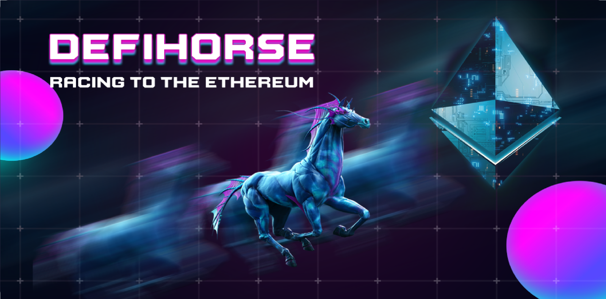
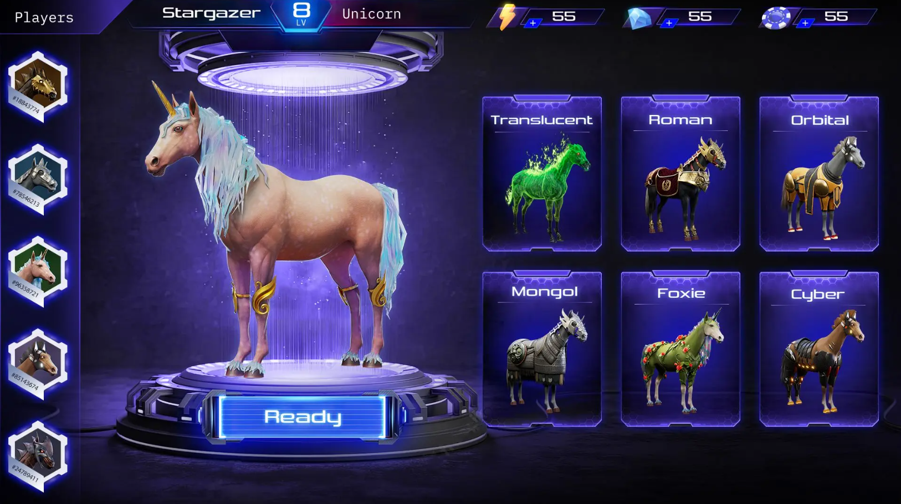
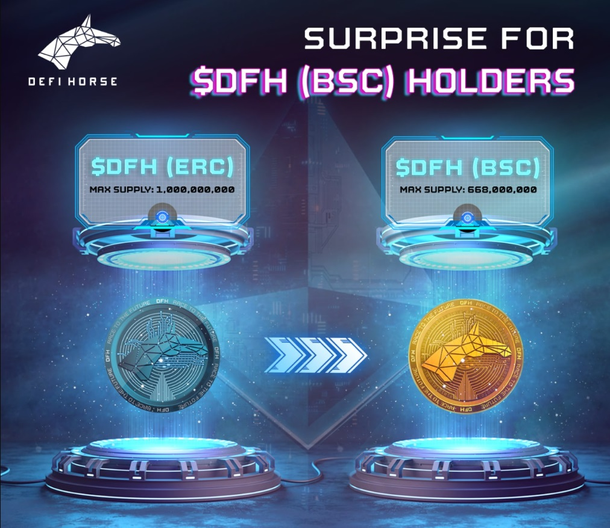

# DeFiHorse Ecosystem

DeFiHorse is a horse racing Metaverse e-sports game built on Blockchain technology and NFTs. Players will be able to experience and enjoy horse racing on a whole new level when they enter DeFiHorse. The game provides you with majestic legendary War Horses that you use to compete in infinite Cyberpunk horse races.

The TAP TO EARN system of DeFiHorse allows users to directly interact with the game, improving the character's experience. During the race, in addition to equipping items and breeding horses, players can interact with reality to help their steed outperform other competitors. There are also additional aspects in the game, such as the Horseverse, which lets users acquire land, buy stables, or choose and arrange their own horse races. Because this is a unique system that only DeFiHorse has, this game is projected to become the next big thing in the world of NFT horse racing games.



### What is DeFiHorse?

DeFiHorse is a metaverse e-sports game centered around horse racing, leveraging blockchain technology and NFTs to create a dynamic and interactive gaming experience. In this virtual world, players can engage in a variety of activities including buying, selling, breeding, and racing NFT horses. The game aims to revolutionize the traditional horse racing industry by integrating digital assets, allowing for a play-to-earn model where participants can earn real-life profits through gameplay.

 

### How is DeFiHorse secured?

DeFiHorse employs a multifaceted approach to security, ensuring a robust and safe environment for its users. The foundation of its security infrastructure is built on self-executing smart contracts. These contracts automate transactions and agreements, reducing the need for intermediaries and thereby minimizing the risk of fraud and errors.

In addition to smart contracts, DeFiHorse leverages decentralized wallets and exchanges. This decentralization ensures that users have full control over their assets, with transactions being transparent and immutable on the blockchain. This setup significantly reduces the risk of hacking and unauthorized access compared to traditional centralized systems.

### How will DeFiHorse be used?

DeFiHorse introduces an innovative approach to the intersection of gaming, finance, and blockchain technology. It leverages the power of decentralized finance (DeFi) mechanisms and non-fungible tokens (NFTs) to create a dynamic and engaging Metaverse eSports game centered around horse racing. This platform is designed to cater to a wide audience, ranging from cryptocurrency enthusiasts to gamers and investors interested in the burgeoning field of digital assets and virtual experiences.

# Stake Or Farm your ETH To Join The Best IGOs

Staking is presently accessible on the Sepolia Testnet, where participants will receive proportional DFH Medal Points following the Token Generation Event (TGE) date for the DFH Token.



# DeFiHorse Price Live Data

The live DeFiHorse price today is $0.00302 USD with a 24-hour trading volume of $93.29 USD. We update our DFH to USD price in real-time. DeFiHorse is up 0.39% in the last 24 hours. The current CoinMarketCap ranking is #5181, with a live market cap of not available. The circulating supply is not available and a max. supply of 668,000,000 DFH coins.


### Install dependencies ( v18.x / v20.x / v22.x )

```
   npm install
```

### Run on localhost

```
   npm start
```
